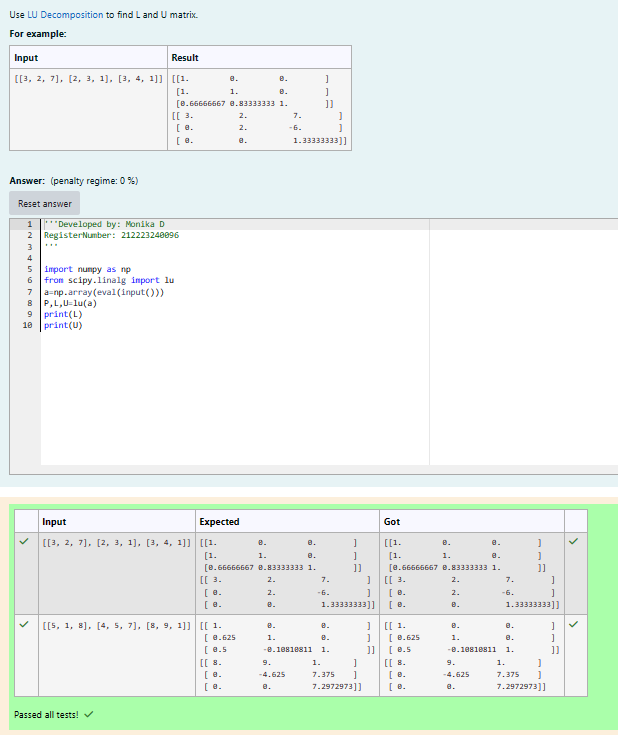
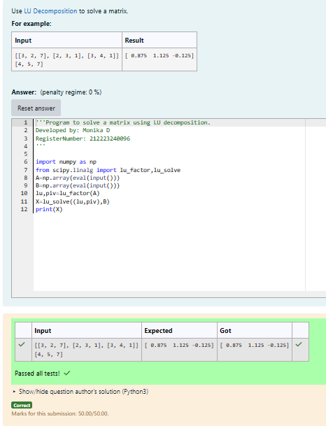

# LU Decomposition 

## AIM:
To write a program to find the LU Decomposition of a matrix.

## Equipments Required:
1. Hardware – PCs
2. Anaconda – Python 3.7 Installation / Moodle-Code Runner

## Algorithm
1. Define the package as scipy.linalg import lu.
2. Get input from user and print L and U matrix by 'print' .
3. Define a package as "from scipy.linalg import lu_factor, lu_solve" and create the variable as 'X' include the package in that variable.
4. print the variable 'X'

## Program:
## 1. To find the L and U matrix
~~~
Developed by: Monika D
RegisterNumber: 212223240096

import numpy as np
from scipy.linalg import lu
a=np.array(eval(input()))
P,L,U=lu(a)
print(L)
print(U)
~~~

## 2. To find the LU Decomposition of a matrix
~~~
Program to solve a matrix using LU decomposition.
Developed by: Monika D
RegisterNumber: 212223240096

import numpy as np
from scipy.linalg import lu_factor,lu_solve
A=np.array(eval(input()))
B=np.array(eval(input()))
lu,piv=lu_factor(A)
X=lu_solve((lu,piv),B)
print(X)
~~~

## Output:

## 1. To find the L and U matrix

## 2. To find the LU Decomposition of a matrix

## Result:
Thus the program to find the LU Decomposition of a matrix is written and verified using python programming.

